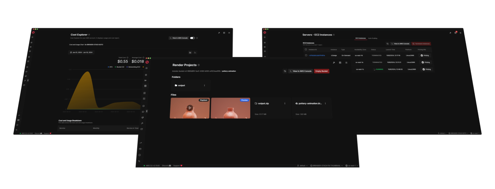

# Brender Studio App

    

    

Brender Studio is a desktop application that allows you to render your Blender projects in the AWS cloud easily.

<!-- > [!WARNING]  
> This project is under development. We are working hard to release the first version of Brender Studio. Stay tuned for updates! -->
> [!IMPORTANT]  
> We have detected issues accessing Blender's `bpy` module when using custom render settings in versions 4.2.0 and later. These issues occur if values are overridden during rendering. The development team is aware of this problem and will address it as soon as possible. For now, we recommend using the default render form configuration without overriding any settings.

## What is Brender Studio?

Brender Studio is a tool designed for artists and creators who use Blender. It allows you to:

- Create your own render farm on AWS
- Accelerate your rendering processes
- Control your rendering costs

With Brender Studio, you can focus on creating, not waiting.

## Key Features

- Support for Cycles and Eevee render engines
- Compatible with Blender 3.3, 3.6, 4.2+
- Available for Windows, MacOS, and Linux
- Customizable scene settings
- Batch rendering
- EC2 Spot and On-Demand instance support
- CPU and GPU rendering (AWS G5 and G6 instances)
- Email notifications for render completion and errors
- AWS Cost Explorer: Detailed cost and usage breakdown
- Python scripting support
- Pre-built BPY scripts
- Custom environment variables for scripts
- Boto3 integration for AWS services

## Download

You can download the latest version of Brender Studio from our official website:

[Download Brender Studio](https://www.brenderstudio.com/download)

You can also find previous versions in the [Releases](https://github.com/Brender-Studio/brender-studio-app/releases) section of this repository.

## User Guides

To learn how to set up AWS, Brender Studio, and how to deploy your render farm, visit our official documentation:

[Brender Studio Guides](https://www.brenderstudio.com/docs/guides/getting-started)

## Getting Started

1. [Create an AWS account](https://www.brenderstudio.com/docs/guides/prerequisites)
2. [Set up AWS CLI v2 on your local machine](https://www.brenderstudio.com/docs/guides/install-aws-cli)
3. [Download and install Brender Studio on your computer](https://www.brenderstudio.com/download)
4. [Connect Brender Studio with your AWS account](https://www.brenderstudio.com/docs/guides/install-brender-studio)
5. [Deploy your render farm ](https://www.brenderstudio.com/docs/guides/deploy-first-farm)
6. [Start rendering your projects in the cloud!](https://www.brenderstudio.com/docs/guides/your-first-render)

## Support

If you have any questions or need help, don't hesitate to:

- Check our [documentation](https://www.brenderstudio.com/docs)
- [Discord - Brender Studio](https://discord.gg/z7sBb4J5r5)
- [Youtube - Brender Studio Channel ](https://www.youtube.com/channel/UCLDB1QSY2579ynddOXv1G7g)

Thank you for using Brender Studio! We hope this tool helps you take your Blender projects to the next level.
